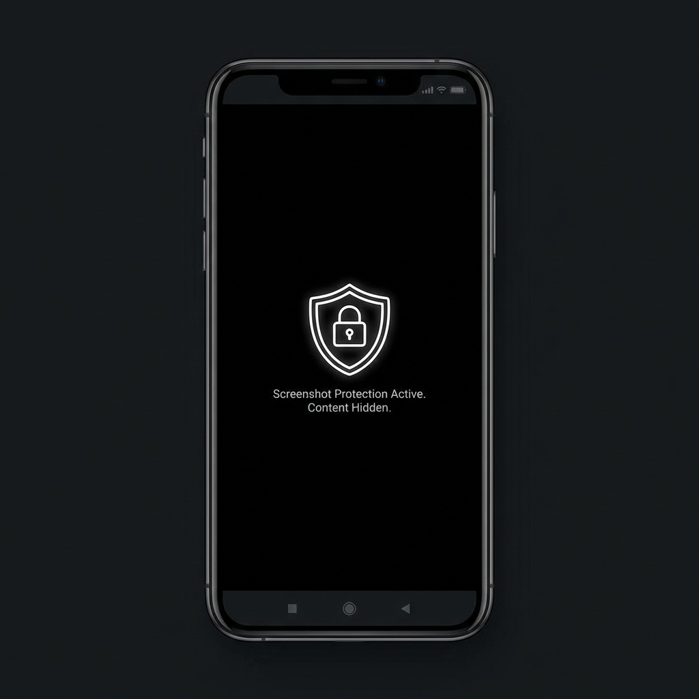
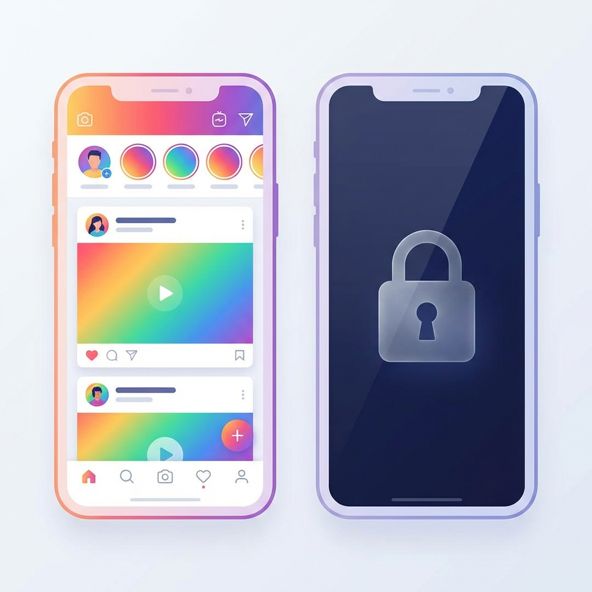
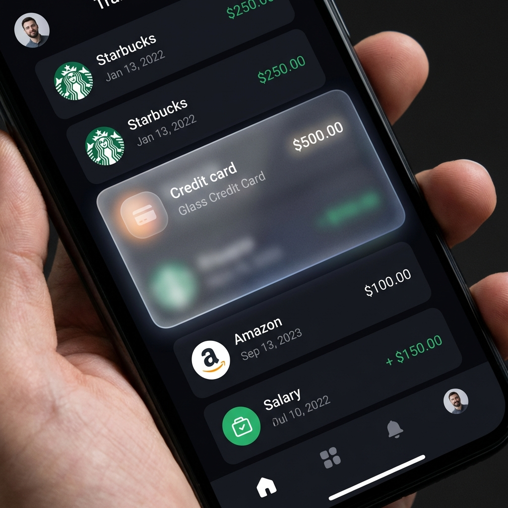

# 🛡️ Prevent App Screen

A powerful, easy-to-use Flutter plugin to protect your app from **Screenshots** and **Screen Recordings**. Perfect for banking, medical, or private social apps.

---

## 🌟 Three Levels of Protection

### 1️⃣ Global Protection (App-Wide)
Protect every single screen in your app with one line of code.
<p align="center">
  
</p>

```dart
void main() {
  // Lock the entire app instantly
  PreventAppScreen.initialize(true); 
  runApp(MyApp());
}
```

---

### 2️⃣ Full Screen Guard
Only protect specific sensitive screens (like Payment or Profile).
<p align="center">
  
</p>

```dart
@override
Widget build(BuildContext context) {
  return FullScreenProtection(
    prevent: true, // Auto-release when you leave this screen
    child: Scaffold(
      body: Text("This page is totally secure!"),
    ),
  );
}
```

---

### 3️⃣ Specific Widget Blur (Smart Masking)
Blur only the sensitive parts (like Credit Cards) while keeping the rest of the UI visible.
<p align="center">
  
</p>

```dart
SpecificWidgetProtection(
  prevent: true,    // Blurs automatically if recording is detected
  blurAmount: 20,   // Customize the blur intensity
  child: Card(
    child: Text("Credit Card: 4532 - **** - **** - 1234"),
  ),
)
```

---

## 🔥 Features
*   ✅ **Block Screenshots**: Prevents capturing sensitive info.
*   ✅ **Hide in Task Manager**: App content is hidden in the Recent Apps switcher.
*   ✅ **Smart Recording Detection**: Detects screen recording and blurs content immediately.
*   ✅ **Simple API**: Designed for developers who value speed and security.

## 📦 Installation

Add this to your `pubspec.yaml`:

```yaml
dependencies:
  prevent_app_screen: ^0.1.0
```

---

## 💻 Platform Support

| Feature | Android | iOS |
| :--- | :---: | :---: |
| **Screenshot Blocking** | ✅ | ✅ |
| **Recording Detection** | ✅ | ✅ |
| **App Switcher Blur** | ✅ | ✅ |
| **Partial Blur** | ✅ | ✅ |

---

## 📝 License
This project is licensed under the MIT License - see the [LICENSE](LICENSE) file for details.
